# Project Background
The dataset contains almost 10,000 transaction records related to sales operations across the United States. It includes various details such as order dates, shipping times, customer information, regional data, and product specifics. Products are organized into three main categories—Furniture, Office Supplies, and Technology—with further segmentation into sub-categories. Additionally, the dataset captures financial metrics like Sales, Profit, Discount, and Quantity sold, allowing for a comprehensive analysis of performance across different dimensions. The data is well-structured and clean, making it suitable for business intelligence insights.
Insights and recommendations are provided on the following key areas:


# Data Structure & Initial Checks
The companies main database structure as seen below consists of one table: Superstore, with a total row count of 9994 records. A description of each table is as follows:

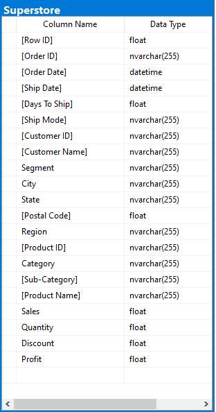


# Insights 
Each query is followed by a business-focused explanation highlighting the implications of the data.

## 1. Profits Based on Category

```sql
SELECT 
    Category, 
    FORMAT(SUM(Profit), 'C') AS Total_Profit
FROM Superstore
GROUP BY Category
ORDER BY SUM(Profit) DESC;
```

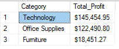

**Summary:** This ranks product categories by profit. It helps prioritize which product lines to expand or promote.

---

## 2. Sales and Profit Trends by Sub-Category

```sql
SELECT 
    SubCategory, 
    FORMAT(SUM(Sales), 'C') AS Total_Sales, 
    FORMAT(SUM(Profit), 'C') AS Total_Profit
FROM Superstore
GROUP BY SubCategory
ORDER BY SUM(Sales) DESC;
```

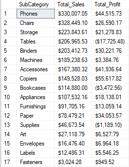

**Summary:** Identifies sub-categories that drive sales and profit, helping optimize inventory and pricing strategies.

---

## 3. Profitability vs. Sales for Each Category

```sql
SELECT 
    Category, 
    FORMAT(SUM(Sales), 'C') AS Total_Sales, 
    FORMAT(SUM(Profit), 'C') AS Total_Profit,
    Round((SUM(Profit) / SUM(Sales)) * 100, 2) AS Profit_Margin_Percentage
FROM Superstore
GROUP BY Category
ORDER BY Profit_Margin_Percentage DESC;
```

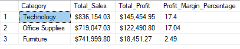

**Summary:** Compares sales to profit margin to reveal which high-sales categories may have poor profitability.

---

## 4. Monthly Sales Trend Analysis

```sql
SELECT 
    FORMAT([Order Date], 'yyyy-MM') AS Month,
    FORMAT(SUM(Sales), 'C') AS Total_Sales,
    FORMAT(SUM(Profit), 'C') AS Total_Profit
FROM Superstore
GROUP BY FORMAT([Order Date], 'yyyy-MM')
ORDER BY Month ASC;
```

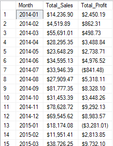

**Summary:** Tracks monthly sales and profit trends to help identify peak periods and seasonal impacts.

---

## 5. Profitable Categories Using CTE

```sql
WITH SalesSummary AS (
    SELECT 
        Category, 
        FORMAT(SUM(Sales), 'C') AS Total_Sales,
        FORMAT(SUM(Profit), 'C') AS Total_Profit
    FROM Superstore
    GROUP BY Category
)
SELECT * FROM SalesSummary WHERE CONVERT(float,REPLACE(REPLACE(Total_Profit, ',', ''), '$', '')) > 10000;
```

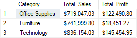

**Summary:** Filters categories to show only those exceeding a $10,000 profit threshold, spotlighting potential growth areas.

---

## 6. Regional Sales with Window Functions

```sql
SELECT 
    Region, 
    Category,
	SubCategory,
	[Product Name],
    FORMAT(Sales, 'C') AS Sales, 
    FORMAT(SUM(Sales) OVER (PARTITION BY Region), 'C') AS Regional_Sales
FROM Superstore
ORDER BY Region, Category, SubCategory;
```

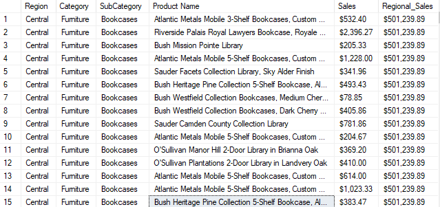

**Summary:** Combines individual sales records with regional totals for deeper performance insights.

---

## 7. Pivoting Sales Data by Region and Category

```sql
SELECT 
    Category,
    FORMAT(SUM(CASE WHEN Region = 'East' THEN Sales ELSE 0 END), 'C') AS East_Sales,
    FORMAT(SUM(CASE WHEN Region = 'West' THEN Sales ELSE 0 END), 'C') AS West_Sales,
    FORMAT(SUM(CASE WHEN Region = 'South' THEN Sales ELSE 0 END), 'C') AS South_Sales,
    FORMAT(SUM(CASE WHEN Region = 'Central' THEN Sales ELSE 0 END), 'C') AS Central_Sales
FROM Superstore
GROUP BY Category;
```

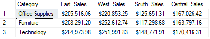

**Summary:** Restructures data to compare category sales across all regions, useful for targeting regional strategies.

---

## 8. High Volume Customers

```sql
SELECT [Customer ID], COUNT([Order ID]) AS Number_Orders,  FORMAT(SUM(Sales), 'C') AS Total_Sales
FROM Superstore
GROUP BY [Customer ID]
HAVING COUNT([Order ID]) > 10
ORDER BY SUM(Sales) DESC;
```

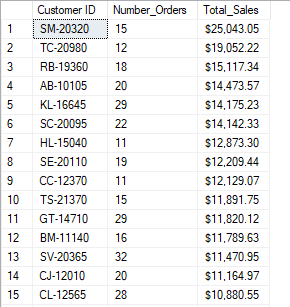

**Summary:** Identifies repeat high-value customers for loyalty or targeted promotions.

---

## 9. Region Sales Contribution Percentage

```sql
WITH TotalSales AS (
    SELECT SUM(Sales) AS OverallSales FROM Superstore
)
SELECT Region, FORMAT(SUM(Sales), 'C') AS RegionalSales, 
       ROUND((SUM(Sales) * 100.0 / (SELECT OverallSales FROM TotalSales)), 2) AS Sales_Percentage
FROM Superstore
GROUP BY Region
ORDER BY Sales_Percentage DESC;
```

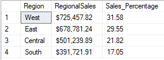

**Summary:** Measures each region's contribution to total sales, helping focus attention where it matters most.

---

## 10. Total Sales and Profit by Region

```sql
WITH RegionSales AS (
    SELECT Region, FORMAT(SUM(Sales), 'C') AS Total_Sales, FORMAT(SUM(Profit), 'C') AS Total_Profit
    FROM Superstore
    GROUP BY Region
)
SELECT * FROM RegionSales
ORDER BY Total_Sales DESC;
```

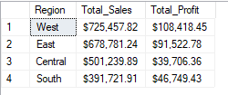

**Summary:** This query shows how each region performs in terms of revenue and profit. It highlights areas of strong revenue and identifies regions that may need strategic improvement.

---

## 11. Customer Sales & Profit Analysis

```sql
WITH CustomerLifetimeValue AS (
    SELECT [Customer ID], FORMAT(SUM(Sales), 'C') AS Lifetime_Sales, FORMAT(SUM(Profit), 'C') AS Lifetime_Profit
    FROM Superstore
    GROUP BY [Customer ID]
)
SELECT [Customer ID], Lifetime_Sales, Lifetime_Profit, 
       RANK() OVER (ORDER BY CAST(REPLACE(REPLACE(Lifetime_Sales, ',', ''), '$', '') As FLOAT) DESC) AS Sales_Rank
FROM CustomerLifetimeValue;
```

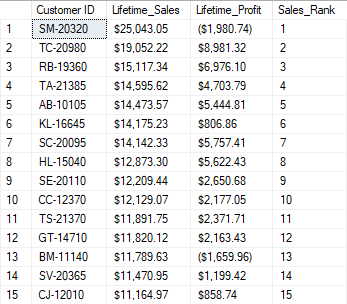

**Summary:** Ranks customers by total spending, revealing top revenue generators.

---

## 12. Discount Impact on Profitability

```sql
SELECT Discount, FORMAT(AVG(Profit), 'C') AS Avg_Profit
FROM Superstore
GROUP BY Discount
ORDER BY Discount;
```

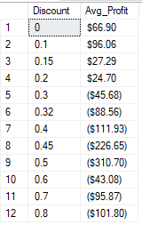

**Summary:** Analyzes average profit at different discount levels to evaluate if discounts are too aggressive.

---

## 13. Yearly Sales Growth

```sql
WITH YearlySales AS (
    SELECT YEAR([Order Date]) AS Year, SUM(Sales) AS Total_Sales
    FROM Superstore
    GROUP BY YEAR([Order Date])
)
SELECT Year, FORMAT(Total_Sales, 'C') As Current_Sales, 
       LAG(FORMAT(Total_Sales, 'C'),1,0) OVER (ORDER BY Year) AS Previous_Year_Sales,
       ISNULL(ROUND((Total_Sales - LAG(Total_Sales) OVER (ORDER BY Year)) * 100.0 / LAG(Total_Sales) OVER (ORDER BY Year), 2), 0) AS YoY_Growth
FROM YearlySales;
```

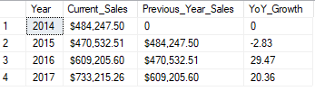

**Summary:** Tracks year-over-year growth to evaluate business trajectory.

---

## 14. Discount by Category

```sql
SELECT Category, ROUND(AVG(Discount), 2) AS Avg_Discount
FROM Superstore
GROUP BY Category
ORDER BY Avg_Discount DESC;
```

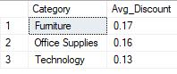

**Summary:** Shows which categories are discounted most frequently to assess potential impact on profit.

---

## 15. Monthly Sales Trend

```sql
WITH MonthlySales AS (
    SELECT FORMAT([Order Date], 'yyyy-MM') AS Month, SUM(Sales) AS Total_Sales
    FROM Superstore
    GROUP BY FORMAT([Order Date], 'yyyy-MM')
)
SELECT Month, FORMAT(Total_Sales, 'C') AS Total_Sales, 
       FORMAT(LEAD(Total_Sales) OVER (ORDER BY Month) - Total_Sales, 'C') AS Sales_Change
FROM MonthlySales;
```

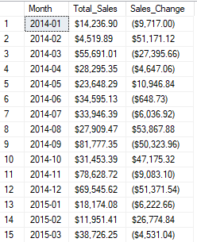

**Summary:** Highlights month-to-month changes in sales to support proactive business planning.
